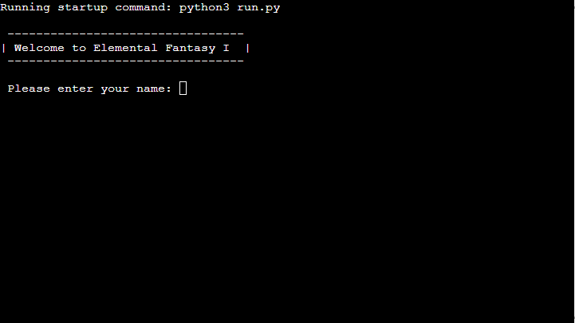
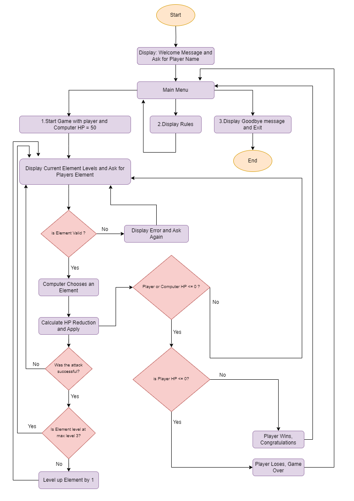

# [ELEMENTAL FANTASY I](https://elemental-fantasy-1-3deca635fd1a.herokuapp.com)

Elemental Fantasy I is a terminal based turn based game implemented in Python . The projecth runs in the Code Institute mock terminal on Heroku. The game takes the simple style of Rock, Paper, Scissors and adds a Final Fantasy twist with elements and hit points (HP). Dive right in to this fun and user-friendly game to defeat your opponent.



Note: Markdown files (.md) should not contain HTML elements like `img`, `br`, `div`, `a`, etc, only Markdown formatting.
Find out more about using Markdown elements here:
https://pandao.github.io/editor.md/en.html

## User Stories

### New Site Users

- As a new user, I would like to see a simple yet effective user interface where I can easily navigate through all menus with ease.
- As a new user, I would like to be able to understand the rules/instructions of the game easily, so I do not get confused while playing the game.
- As a new user, I would like to be able to dive into the game quickly and without the need to create an account to play.
- As a new user, I would want to be able to score counter, so that I can view how many wins I have.

### Returning Site Users

- As a returning user, I would like to see a multiplayer feature, so I am able to play against friends or family.
- As a returning user, I would like to see the game implement challenges or new elements, so that it can keep me engaged to play more regularly.
- As a returning user, I would like to receive notifications on new updates, challenges or features, so that it keeps me coming back to play and not miss out on new content.
- As a returning user, I would like to have an option to provide feedback, so I am able to help improve the game.


## Features

### Existing Features

- **Welcome Message and Name Input** 

    - A Prompt which lets the user add their name to personalise the experience.


- **Play Game**

    - Menu option which allows users to jump straight into the game.


- **View Rules**

    - Menu option which allows users to get familiar with the game rules.


- **Quit Game**

    - Menu option which allows users to Quit the programme.


🛑🛑🛑🛑🛑 END OF NOTES (to be deleted) 🛑🛑🛑🛑🛑

### Future Features


- Graphic User Interface Update
    - Implement a more user-friendly graphic user interface which lets players see their character battle against the opponent.
- Special Elements
    - Implement special elements. That provide the user’s with elements that will only be able to be used certain times during the game such as Cure (Heal user’s hit points), Poison(reduce user’s hit points after every turn) and Protect (Increases users defence against attacks).
- Multiple Enemies and level up system
    - Implement a level up system where the user’s elements and hit points increase the more they play. As players progress through the level up system multiple enemies will be introduced also to keep the user intrigued and provide more challenges.

## Tools & Technologies Used

- [Python](http://python.org) Used to develop server-side logic and game functions.
- [Git](http://git-scm.com) A version control system used to track changes in the codebase.
- [GitHub](http://github.com) Provides secure online storage for the project's code.
- [Visual Studio Code](http://code.visualstudio.com) Served as the Intergrated Development Environment (IDE) for the project.
- [Heroku](http://heroku.com) A cloud platform used for hosting the deployed back-end of the site.

## Data Model

### Flowchart

To follow best practice, a flowchart was created for the app's logic,
and mapped out before coding began using a free version of
[Lucidchart](https://www.lucidchart.com/pages/ER-diagram-symbols-and-meaning) and/or [Draw.io](https://www.draw.io).

Below is the flowchart of the main process of this Python program. It shows the entire cycle of the program.



### Classes & Functions

The program uses classes as a blueprint for the project's objects (OOP). This allows for the object to be reusable.

```python
class Person:
    """ Insert docstring comments here """
    def __init__(self, name, age, health, inventory):
        self.name = name
        self.age = age
        self.health = health
        self.inventory = inventory
```

The primary functions used on this application are:


- `main()`
    - Run all program functions.
- `input_Player_name()`
    - This function is used to get the player to input their name which will be used to personalise the experience.
- `main_menu()`
    - The main menu which displays options for the user to choose.
- `get_menu_choice()`
    - Function which takes in user input for menu choices.
- `show_rules()`
    - Function which prints game rules/instructions.
- `play_game(player_name)`
    - Main game function which takes in player inputs against their hitpoints as well as calling the player_name data.
- `start_game(player_name)`
    - Function used to display a message before starting the game as well as calling the player_name data.
- `element_hitpoint_reduction(player_name, player_move, computer_move, player_hitpoints, computer_hitpoints)`
    - Run all program functions.
- `Capitlize()`
    - Function which capitlises the players input when they choose their element.

### Imports

I've used only one Python packages and/or external imported package:

- `random`: used to get a random choice from a list

## Testing

For all testing, please refer to the [TESTING.md](TESTING.md) file.

## Deployment

Code Institute has provided a [template](https://github.com/Code-Institute-Org/python-essentials-template) to display the terminal view of this backend application in a modern web browser.
This is to improve the accessibility of the project to others.

The live deployed application can be found deployed on [Heroku](https://elemental-fantasy-1-3deca635fd1a.herokuapp.com).

### Heroku Deployment

This project uses [Heroku](https://www.heroku.com), a platform as a service (PaaS) that enables developers to build, run, and operate applications entirely in the cloud.

Deployment steps are as follows, after account setup:

- Select **New** in the top-right corner of your Heroku Dashboard, and select **Create new app** from the dropdown menu.
- Your app name must be unique, and then choose a region closest to you (EU or USA), and finally, select **Create App**.
- From the new app **Settings**, click **Reveal Config Vars**, and set the value of KEY to `PORT`, and the value to `8000` then select *add*.
- If using any confidential credentials, such as CREDS.JSON, then these should be pasted in the Config Variables as well.
- Further down, to support dependencies, select **Add Buildpack**.
- The order of the buildpacks is important, select `Python` first, then `Node.js` second. (if they are not in this order, you can drag them to rearrange them)

Heroku needs two additional files in order to deploy properly.

- requirements.txt
- Procfile

You can install this project's **requirements** (where applicable) using:

- `pip3 install -r requirements.txt`

If you have your own packages that have been installed, then the requirements file needs updated using:

- `pip3 freeze --local > requirements.txt`

The **Procfile** can be created with the following command:

- `echo web: node index.js > Procfile`

For Heroku deployment, follow these steps to connect your own GitHub repository to the newly created app:

Either:

- Select **Automatic Deployment** from the Heroku app.

Or:

- In the Terminal/CLI, connect to Heroku using this command: `heroku login -i`
- Set the remote for Heroku: `heroku git:remote -a app_name` (replace *app_name* with your app name)
- After performing the standard Git `add`, `commit`, and `push` to GitHub, you can now type:
	- `git push heroku main`

The frontend terminal should now be connected and deployed to Heroku!

### Local Deployment

This project can be cloned or forked in order to make a local copy on your own system.

For either method, you will need to install any applicable packages found within the *requirements.txt* file.

- `pip3 install -r requirements.txt`.

If using any confidential credentials, such as `CREDS.json` or `env.py` data, these will need to be manually added to your own newly created project as well.

#### Cloning

You can clone the repository by following these steps:

1. Go to the [GitHub repository](https://github.com/riiyu7/Elemental_Fantasy_I) 
2. Locate the Code button above the list of files and click it 
3. Select if you prefer to clone using HTTPS, SSH, or GitHub CLI and click the copy button to copy the URL to your clipboard
4. Open Git Bash or Terminal
5. Change the current working directory to the one where you want the cloned directory
6. In your IDE Terminal, type the following command to clone my repository:
	- `git clone https://github.com/riiyu7/Elemental_Fantasy_I.git`
7. Press Enter to create your local clone.

Alternatively, if using Gitpod, you can click below to create your own workspace using this repository.

[](https://gitpod.io/#https://github.com/riiyu7/Elemental_Fantasy_I)

Please note that in order to directly open the project in Gitpod, you need to have the browser extension installed.
A tutorial on how to do that can be found [here](https://www.gitpod.io/docs/configure/user-settings/browser-extension).

#### Forking

By forking the GitHub Repository, we make a copy of the original repository on our GitHub account to view and/or make changes without affecting the original owner's repository.
You can fork this repository by using the following steps:

1. Log in to GitHub and locate the [GitHub Repository](https://github.com/riiyu7/Elemental_Fantasy_I)
2. At the top of the Repository (not top of page) just above the "Settings" Button on the menu, locate the "Fork" Button.
3. Once clicked, you should now have a copy of the original repository in your own GitHub account!

### Local VS Deployment

🛑🛑🛑🛑🛑 START OF NOTES (to be deleted) 🛑🛑🛑🛑🛑

Use this space to discuss any differences between the local version you've developed, and the live deployment site on Heroku.

🛑🛑🛑🛑🛑 END OF NOTES (to be deleted) 🛑🛑🛑🛑🛑

## Credits

🛑🛑🛑🛑🛑 START OF NOTES (to be deleted) 🛑🛑🛑🛑🛑

In this section you need to reference where you got your content, media, and extra help from.
It is common practice to use code from other repositories and tutorials,
however, it is important to be very specific about these sources to avoid plagiarism.

🛑🛑🛑🛑🛑 END OF NOTES (to be deleted) 🛑🛑🛑🛑🛑

### Content

🛑🛑🛑🛑🛑 START OF NOTES (to be deleted) 🛑🛑🛑🛑🛑

Use this space to provide attribution links to any borrowed code snippets, elements, or resources.
A few examples have been provided below to give you some ideas.

Ideally, you should provide an actual link to every resource used, not just a generic link to the main site!

🛑🛑🛑🛑🛑 END OF NOTES (to be deleted) 🛑🛑🛑🛑🛑

| Source | Location | Notes |
| --- | --- | --- |
| [Markdown Builder](https://tim.2bn.dev/markdown-builder) | README and TESTING | tool to help generate the Markdown files |
| [Chris Beams](https://chris.beams.io/posts/git-commit) | version control | "How to Write a Git Commit Message" |
| [W3Schools](https://www.w3schools.com/howto/howto_js_topnav_responsive.asp) | entire site | responsive HTML/CSS/JS navbar |
| [W3Schools](https://www.w3schools.com/howto/howto_css_modals.asp) | contact page | interactive pop-up (modal) |
| [W3Schools](https://www.w3schools.com/css/css3_variables.asp) | entire site | how to use CSS :root variables |
| [Flexbox Froggy](https://flexboxfroggy.com/) | entire site | modern responsive layouts |
| [Grid Garden](https://cssgridgarden.com) | entire site | modern responsive layouts |
| [StackOverflow](https://stackoverflow.com/a/2450976) | quiz page | Fisher-Yates/Knuth shuffle in JS |
| [YouTube](https://www.youtube.com/watch?v=YL1F4dCUlLc) | leaderboard | using `localStorage()` in JS for high scores |
| [YouTube](https://www.youtube.com/watch?v=u51Zjlnui4Y) | PP3 terminal | tutorial for adding color to the Python terminal |
| [strftime](https://strftime.org) | CRUD functionality | helpful tool to format date/time from string |
| [WhiteNoise](http://whitenoise.evans.io) | entire site | hosting static files on Heroku temporarily |


### Acknowledgements

🛑🛑🛑🛑🛑 START OF NOTES (to be deleted) 🛑🛑🛑🛑🛑

Use this space to provide attribution to any supports that helped, encouraged, or supported you throughout the development stages of this project.
A few examples have been provided below to give you some ideas

🛑🛑🛑🛑🛑 END OF NOTES (to be deleted) 🛑🛑🛑🛑🛑

- I would like to thank my Code Institute mentor, [Tim Nelson](https://github.com/TravelTimN) for their support throughout the development of this project.
- I would like to thank the [Code Institute](https://codeinstitute.net) tutor team for their assistance with troubleshooting and debugging some project issues.
- I would like to thank the [Code Institute Slack community](https://code-institute-room.slack.com) for the moral support; it kept me going during periods of self doubt and imposter syndrome.
- - I would like to thank my personal Tutor, [Mosahidur R.](https://www.mytutor.co.uk/students/secure/tutors/2038828/) for support and guidance throughout the development of this project. Python lessons and project review have assisted with enhancing the overall project from a simple rock, paper scissors game.
- I appreciate the resources and tutorials available online such as Stack Overflow and youtube and Youtube: NeuralNine  which assisted in creating basic structure of project from rock paper scissors
