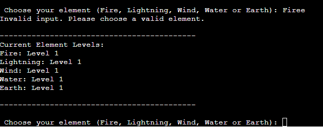

# Testing

Return back to the [README.md](README.md) file.

## Code Validation

### Python

I have used the recommended [PEP8 CI Python Linter](https://pep8ci.herokuapp.com) to validate all of my Python files.

| File | CI URL | Screenshot | Notes |
| --- | --- | --- | --- |
| run.py | [PEP8 CI](https://pep8ci.herokuapp.com/https://raw.githubusercontent.com/riiyu7/elemental_fantasy_i/main/run.py) |  | 	Pass: No errors |

## Defensive Programming

| Page | Expectation | Test | Result | Fix | Screenshot |
| --- | --- | --- | --- | --- | --- |
| Input Name | Feature is expected record the user name throughtout the programme| Tested the feature by inputting 'Tally' | The feature behaved as expected, and it recorded the name 'Tally' | Test concluded and passed |  |
| Option 1 - Play Game | Feature is expected to start the game when option '1' is inputted | Tested the feature by inputting '1' | The feature behaved as expected, and started the game.  | Test concluded and passed |  |
| Option 2 - Rules/Instructions | Feature is expected to call show_rules function and display all print functions when option '2' is inputted | Tested the feature by inputting '2' | The feature behaved as expected, and displayed all print functions  | Test concluded and passed |  |
| Option 3 - Quit Game | Feature is expected to do quit the game when option '3' is inputted| Tested the feature by inputting '3'| The feature behaved as expected, and quit the programme | Test concluded and passed |  |
| Play Game | | | | | |
| Fire Element | Feature is expected to do a 'Fire' attack when inputted and 'Fire level' should also go up | Tested the feature by inputting 'Fire' | | |  |
| Lightning Element | Feature is expected to do a 'Lightning' attack when inputted and 'Lightning level' should also go up | Tested the feature by inputting 'Lightning' | | |  |
| Wind Element | Feature is expected to do a 'Wind' attack when inputted and 'Wind level' should also go up | Tested the feature by inputting 'Wind' | | |  |
| Water Element | Feature is expected to do a 'Water' attack when inputted and 'Water level' should also go up | Tested the feature by inputting 'Water' | | |  |
| Earth Element | Feature is expected to do a 'Earth' attack when inputted and 'Earth level' should also go up | Tested the feature by inputting 'Earth' | | |  |
| Input Errors | | | | | |
| Main Menu | Feature is expected to show Error if incorrect option is chosen| Tested the feature by inputting '4'| The feature behaved as expected, and showed an input error | Test concluded and passed |  |
| Game Input 1 | Feature is expected to show Error if incorrect option is chosen| Tested the feature by inputting '12'| The feature behaved as expected, and showed an input error | Test concluded and passed |  |
| Game Input 1 | Feature is expected to show Error if incorrect option is chosen| Tested the feature by inputting 'Firee'| The feature behaved as expected, and showed an input error | Test concluded and passed |  |

## User Story Testing

| User Story | Screenshot |
| --- | --- |
| As a new site user, I would like to see a simple yet effective user interface where I can easily navigate through all menus with ease.|  |
| As a new site user, I would like to be able to understand the rules/instructions of the game easily, so I do not get confused while playing the game. |  |
| As a new site user, I would like to be able to dive into the game quickly and without the need to create an account to play. |  |
| As a new site user, I would want to be able to personalise the experience, so the game feels more engaging.|  |

## Bugs

- IdentationError on line 76

    

    - To fix this, I added an indentation on line 76

- Error within While loop

    

    - To fix this, I changed the following code 'else computer_hitpoints <= 0:' to 'elif computer_hitpoints <= 0:'

- Visual Studio Code showing Errors player_name is not defined:

    

    - To fix this, I changed the following code 'def element_hitpoint_reduction(player_move, computer_move):' to include player_name.

- Visual Studio Code showing Errors 'win_against' is not defined:

    

    - To fix this, I amended line 156 and 150 where the code win_against was in and put them both in '' so the amended code was 'win_against'.

- Visual Studio Code showing Errors 'hitpoints' is not defined:

    

    - To fix this, I amended line 159 and 164 where the code  print(f"Computer hitpoints reduced to {hitpoints[player_move]}") & print(f"{player_name} hitpoints reduced to {hitpoints[computer_move]}") was ameded to print(f"Computer hitpoints reduced to {computer_hitpoints}") & print(f"{player_name} hitpoints reduced to {player_hitpoints}")

- Clear Function Bug:

    

    - To fix this, I amended line 156 and 150 where the code win_against was in and put them both in '' so the amended code was 'win_against'.

## Unfixed Bugs

There are no remaining bugs that I am aware of.
